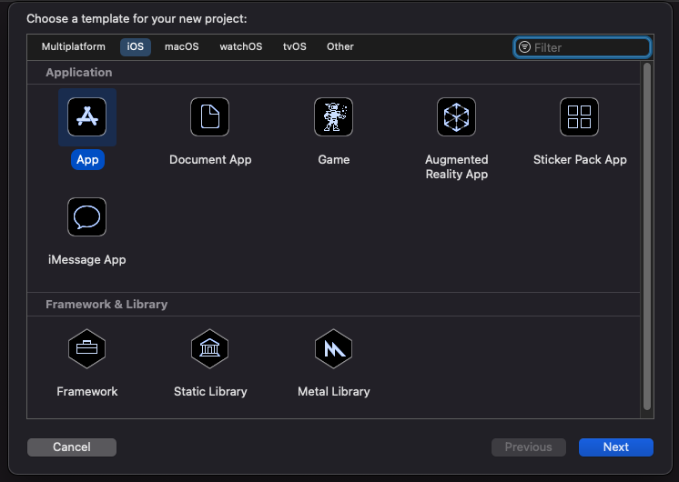
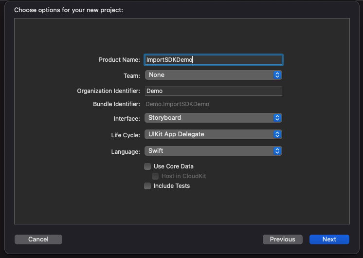
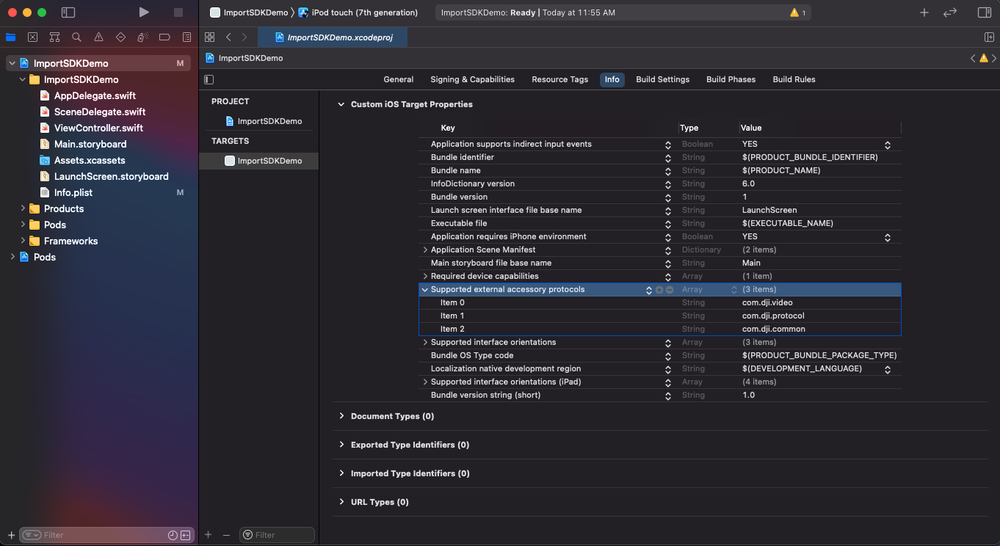
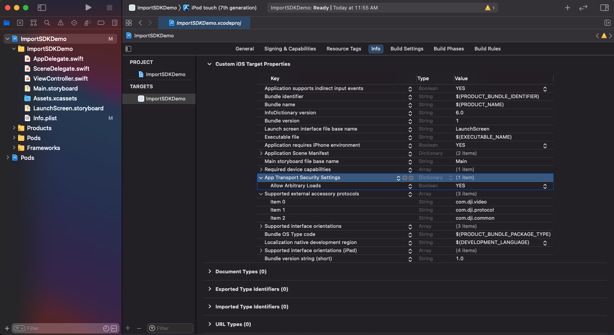
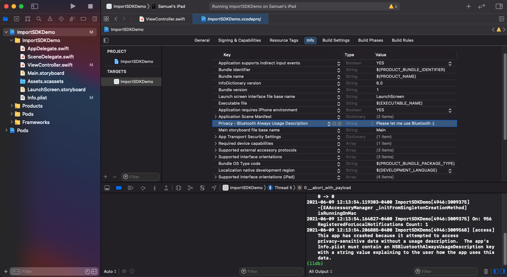

The examples below import the DJI SDK into a new iOS project using Swift. The same steps can be used for integration into an existing application. Download the finished product of this tutorial [here](https://github.com/DJI-Mobile-SDK-Tutorials/iOS-ImportAndActivateSDKInXcode-Swift).

## Xcode Project Integration

Screenshots in this section are generated using Xcode 12.5.

### Create a New Application

   * Open Xcode.
   * Select **File->New->Project**.
   * Select the **iOS tab**.
   * Choose **App** template.
   * Press **Next**.
        
   * "ImportSDKDemo" will be used as the **Product Name**.
   * Other settings can remain as default.
      

### Install SDK with CocoaPods in the Project

   * In Finder, navigate to the root folder of the project, and create a **Podfile**. To learn more about Cocoapods, please check [this guide](https://guides.cocoapods.org/using/getting-started.html#getting-started).
   * Replace the content of the **Podfile** with the following:

   ~~~
    # platform :ios, '9.0'

    target 'ImportSDKDemo' do
        pod 'DJI-SDK-iOS', '~> 4.14’
    end
   ~~~

   * Run the following command in the root folder path:

   ~~~
    pod install
   ~~~

   * If you install the SDK successfully, you should get the messages similar to the following:

   ~~~
    Analyzing dependencies
    Downloading dependencies
    Installing DJI-SDK-iOS (4.12)
    Generating Pods project
    Integrating client project

    [!] Please close any current Xcode sessions and use `ImportSDKDemo.xcworkspace` for this project from now on.
    Pod installation complete! There is 1 dependency from the Podfile and 1 total pod
    installed.
   ~~~

   * The DJI SDK framework should now be downloaded and placed in the `Pods/DJI-SDK-iOS/iOS_Mobile_SDK/DJISDK.framework` path.

### Configure Build Settings

   * Open the **ImportSDKDemo.xcworkspace** file in Xcode.
   * In order to connect to DJI products via USB, add the "Supported external accessory protocols" key to the **info.plist** file, and add the strings "com.dji.video", "com.dji.protocol" and "com.dji.common" to the key.
   
   * Since iOS 9, App Transport Security has blocked cleartext HTTP (http://) resource loading. The "App Transport Security Settings" key must be added and "Allow Arbitrary Loads" must be set to "YES".
   
   * The DJI Mobile SDK needs permission to access Bluetooth. Add the key "Privacy - Bluetooth Always Usage Description" to your info.plist and give it some value.
   

### Register Application

   * Import the DJI SDK header file into `ViewController.swift`.
   * Indicate that ViewController conforms to the `DJISDKManagerDelegate` protocol.

~~~Swift
import UIKit
import DJISDK

class ViewController: UIViewController, DJISDKManagerDelegate {
}
~~~

   * Create a new method `registerApp`.
   * Use the application's Bundle Identifier to [generate an App Key](../quick-start/index.md#Generate-an-App-Key).
   * Create a `DJISDKAppKey` key in the **info.plist** file of the Xcode project and paste the generated App Key string into its string value:

   

   * Invoke `DJISDKManager.registerApp(with:)` in `viewDidLoad()` as shown below:

~~~Swift
    override func viewDidLoad() {
        super.viewDidLoad()
        
        DJISDKManager.registerApp(with: self)
    }
~~~

   * The `DJISDKManagerDelegate` protocol requires the`appRegisteredWithError(_ error:)` and didUpdateDatabaseDownloadProgress(_ progress:) methods to be implemented, but we won't be doing anything in didUpdateDatabaseDownloadProgress(_ progress:)
   * Additionally implement `showAlertViewWithTitle(title: String, withMessage message: String)` to give the registration result in a simple view.

~~~Swift
    func appRegisteredWithError(_ error: Error?) {
        var message = "Register App Successed!"
        if (error != nil) {
            message = "Register app failed! Please enter your app key and check the network."
        } else {
            NSLog("Register App Successed!");
        }

        self.showAlertViewWithTitle(title:"Register App", withMessage: message)
    }

    func didUpdateDatabaseDownloadProgress(_ progress: Progress) {
        //Unused...
    }

    func showAlertViewWithTitle(title: String, withMessage message: String) {
        let alert = UIAlertController.init(title: title, message: message, preferredStyle: UIAlertController.Style.alert)
        let okAction = UIAlertAction.init(title:"OK", style: UIAlertAction.Style.default, handler: nil)
        alert.addAction(okAction)
        self.present(alert, animated: true, completion: nil)
    }
~~~

### Run Import SDK Demo

The **ImportSDKDemo** project can now be run. You can download the sample code of this project from Github: <a href="https://github.com/DJI-Mobile-SDK-Tutorials/iOS-ImportAndActivateSDKInXcode" target="_blank">Objective-C</a> | <a href="https://github.com/DJI-Mobile-SDK-Tutorials/iOS-ImportAndActivateSDKInXcode-Swift" target="_blank">Swift</a>.

As this application is only checking for registration and not interacting directly with a product, no product needs to be connected to the application for this to run. Therefore, the application can either be run on a mobile device (with or without a DJI product connected) or in the iOS simulator. The application will need internet connectivity to perform registration successfully.

If the App Key was generated correctly and the iOS simulator or mobile device has internet connectivity, then the following should be seen:

   